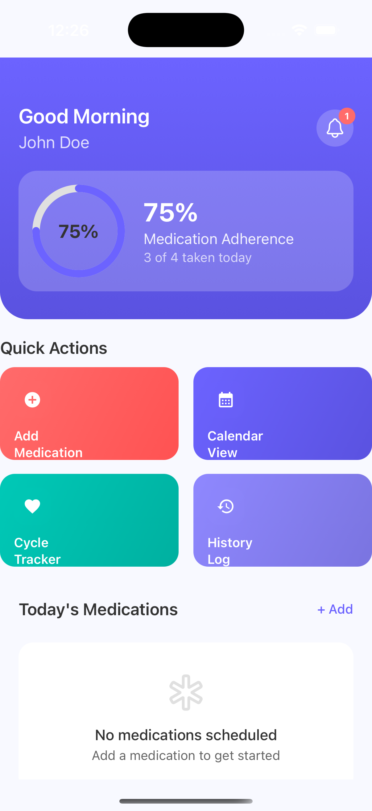
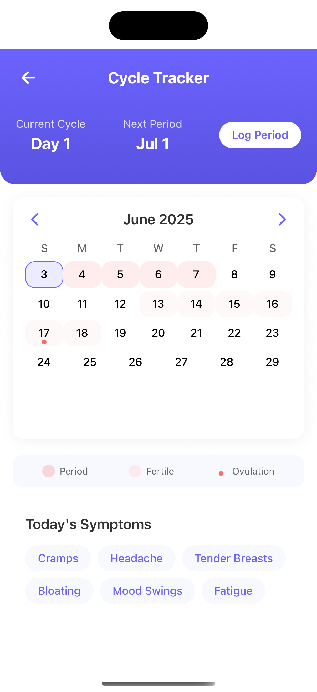
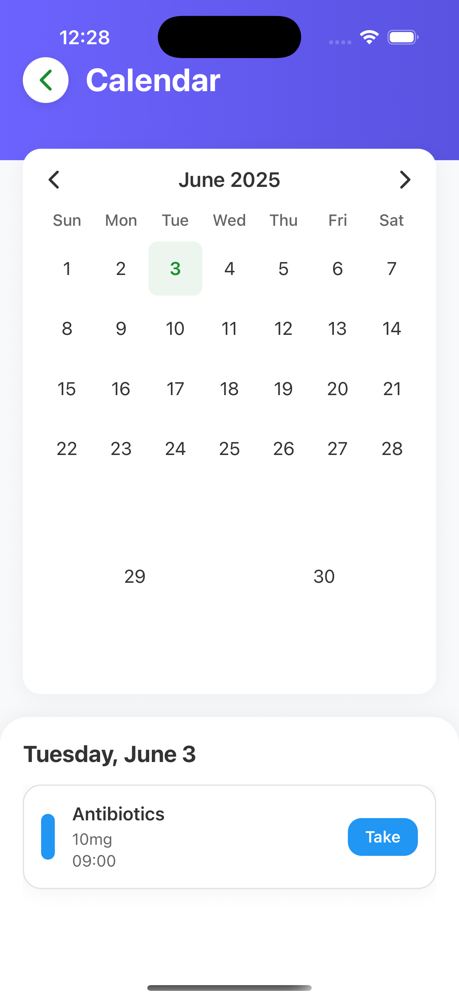

<div align="center">
  <h1>MediNex 2</h1>
  <p>Your all-in-one health companion for medication management and wellness tracking</p>
  
  [](https://reactnative.dev/)
  [](https://expo.dev/)
  [](https://www.typescriptlang.org/)
  [](https://opensource.org/licenses/MIT)

  
  
  
  
  

  
</div>

## 🌟 Features

### 💊 Medication Management
- **Smart Reminders**: Never miss a dose with customizable notifications
- **Medication Database**: Track all your medications in one place
- **Dosage Tracking**: Log when you take your medications
- **Refill Alerts**: Get notified when it's time to refill prescriptions

### 💧 Hydration Tracker (New!)
- **Water Intake Logging**: Track your daily water consumption
- **Customizable Goals**: Set and adjust your daily water intake target
- **Visual Progress**: Beautiful water level indicator showing daily progress
- **Quick Add**: One-tap logging for common water amounts
- **Hydration History**: View your water intake history and trends

### 🌙 Menstrual Cycle Tracker
- **Period Prediction**: Forecast your next period and fertile window
- **Symptom Logging**: Track physical and emotional symptoms
- **Cycle History**: View patterns and trends over time

### 📊 Health Insights
- **Medication Adherence**: Visualize your medication-taking habits
- **Hydration Analytics**: Track your water intake patterns
- **Health Trends**: Identify correlations between symptoms and medications

## 🚀 Getting Started

### Prerequisites
- Node.js (v16 or later)
- npm or yarn
- Expo CLI (`npm install -g expo-cli`)
- iOS Simulator / Android Emulator or physical device with Expo Go

### Installation

1. **Clone the repository**
   ```bash
   git clone https://github.com/asadriz1/medinex-2.git
   cd medinex-2
Install dependencies

bash
Copy
Edit
npm install
# or
yarn install
Start the development server

bash
Copy
Edit
npx expo start
Run on your device

Scan the QR code with your phone's camera (iOS) or the Expo Go app (Android)

Or press i for iOS Simulator / a for Android Emulator

🛠️ Tech Stack
Frontend: React Native with TypeScript

Navigation: Expo Router

State Management: React Hooks & Context API

Storage: AsyncStorage for local data persistence

UI Components: React Native Paper & Custom Components

Icons: Expo Vector Icons

Charts: React Native SVG Charts

📱 Screens
Main Screen	Cycle Tracker	Medication Manager
		

🤝 Contributing
Contributions are welcome! Please follow these steps:

Fork the repository

Create a new branch (git checkout -b feature/amazing-feature)

Commit your changes (git commit -m 'Add some amazing feature')

Push to the branch (git push origin feature/amazing-feature)

Open a Pull Request

📄 License
This project is licensed under the MIT License - see the LICENSE file for details.

🙏 Acknowledgments
Expo for the amazing development platform

React Native Paper for beautiful UI components

All contributors who have helped improve this project

<div align="center"> Made with ❤️ by Asad Rizvi </div> ```
